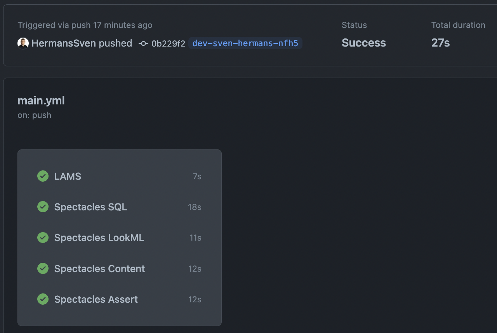

# looker-project-template

## Using the template

Make sure to create a new repository based on this template.
If you want the `wiki_example` to work, don't forget to change the `connection` parameter in `wiki_example/models/wikipedia.model.lkml` with a `BigQuery Standard SQL` Looker connection on your own instance.

## Folder structure

Use the following folder structure for your Looker projects:
```
|-- domain_1
|   |-- dashboards
|   |-- datagroups
|   |-- explores
|   |-- models
|   |-- tests
|   `-- views
|       |-- auto_generated
|       |-- derived_tables
|       `-- refinements
|-- domain_2
|   |-- dashboards
|   |-- datagroups
|   |-- explores
|   |-- models
|   |-- tests
|   `-- views
|       |-- auto_generated
|       |-- derived_tables
|       `-- refinements
```
An example is shown in the `wiki_example` folder.

### Views

The `views` folder has 3 subfolders:
* `auto_generated`: In this folder, generate your views automatically based on your database tables. Make sure to leave 
them untouched, this will allow you to re-generate those views when schema or metadata changes occur in your database.
For example, a column that has been added or a description of a column that has been updated.
* `refinements`: In this folder, make any changes on top of your auto_generated views as 
[refinements](https://cloud.google.com/looker/docs/lookml-refinements).
* `derived_tables`: Define your [(persistent) derived tables](https://cloud.google.com/looker/docs/derived-tables) 
in this folder.

## Github Actions

There are 5 Github Action jobs configured in the file `.github/workflows/main.yml`
* [LAMS style linter](https://github.com/looker-open-source/look-at-me-sideways)
* [Spectacles tester](https://github.com/spectacles-ci/spectacles)
  * SQL
  * LookML
  * Content
  * Assert

To configure this for your Looker project, the only thing you need to do is add 3 variables and 1 secret in your 
Github repository under `Settings` -> `Secrets and Variables` -> `Actions`

* Variables
  * `LOOKER_BASE_URL` (e.g. devoteam.cloud.looker.com)
  * `LOOKER_PROJECT` (e.g. looker_partner_demo)
  * `LOOKER_CLIENT_ID` (e.g. 2SkFjx3nTkrjbqpfk7K6)
* Secrets
  * `LOOKER_CLIENT_SECRET` (e.g. 1QJfqLr6SmmzSe29QMh4xnXg)



### Pull Requests

Make sure to [configure pull requests](https://cloud.google.com/looker/docs/git-options) for your project.
